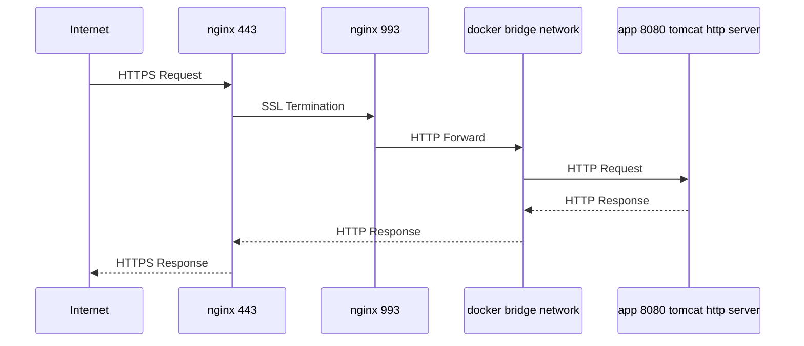

# gs-nonvector-api
Project for non-vector related api using with RESTful communication.

## .env setting

.env is `.gitignored` and only accepted in local 

- DB_URL=jdbc:postgresql:`{DATABASE_URL}`
- DB_USERNAME=`UserName`
- DB_PASSWORD=`PassWord`

## Network Flow

* only Deploy Operation

